# 01 — Navigation Flow (Post-Phase-1)

After Phase 1, the root of the Voyager back stack is `PlaceholderHomeScreen`
(the minimal "Kuta / AniList browse coming soon" stub), not `HomeScreen`. The
tab navigator (`HomeScreen`) is pushed on demand from the placeholder's
"Library" button. Inside `HomeScreen`, the bottom-nav `TabNavigator` renders
five visible tabs — `MangaLibraryTab` is forcibly stripped from `NavStyle.tabs`
in `NavStyle.kt` regardless of the user's `navStyle()` preference, so the
manga library can no longer be reached. Manga detail / reader screens still
exist in the codebase but are unreachable from the visible graph (dashed
nodes below). The single root `Navigator` and the `disposeNestedNavigators =
false` policy are unchanged — pushed detail screens still share one back
stack.

```mermaid
graph TD
    classDef placeholder fill:#e8f0ff,stroke:#3b6fb5,color:#000
    classDef tab fill:#fff4e0,stroke:#cc8a00,color:#000
    classDef screen fill:#eafaf0,stroke:#2e8b57,color:#000
    classDef detail fill:#f3eaff,stroke:#7a3fb5,color:#000
    classDef player fill:#ffe6e6,stroke:#cc3333,color:#000
    classDef mangaUnreachable fill:#eee,stroke:#999,color:#666,stroke-dasharray: 5 5

    %% ---------- Placeholder Home (new root) ----------
    subgraph PH["Placeholder Home (new root)"]
        PlaceholderHome["PlaceholderHomeScreen<br/>— 'Kuta' + subtitle<br/>— Library / Settings buttons"]
    end
    class PlaceholderHome placeholder

    PlaceholderHome -- "Library button → navigator.push(HomeScreen)" --> HomeScreen
    PlaceholderHome -- "Settings button → navigator.push(SettingsScreen)" --> SettingsScreenRoot["SettingsScreen"]

    %% ---------- Tab Navigator ----------
    subgraph TN["Tab Navigator (HomeScreen)"]
        HomeScreen["HomeScreen<br/>— TabNavigator<br/>— 5 visible tabs (manga gated out)<br/>— NavStyle.tabs minus MangaLibraryTab"]
        AnimeLibraryTab["AnimeLibraryTab<br/>index=0"]
        UpdatesTab["UpdatesTab"]
        HistoriesTab["HistoriesTab"]
        BrowseTab["BrowseTab<br/>index=3"]
        MoreTab["MoreTab<br/>index=4"]
        HomeScreen --- AnimeLibraryTab
        HomeScreen --- UpdatesTab
        HomeScreen --- HistoriesTab
        HomeScreen --- BrowseTab
        HomeScreen --- MoreTab
    end
    class HomeScreen,AnimeLibraryTab,UpdatesTab,HistoriesTab,BrowseTab,MoreTab tab

    %% ---------- More Screen destinations ----------
    subgraph MORE["More Screen Destinations (navigator.push)"]
        SettingsScreen["SettingsScreen"]
        CategoriesTab["CategoriesTab"]
        StatsTab["StatsTab"]
        StorageTab["StorageTab"]
        DownloadsTab["DownloadsTab"]
        PlayerSettingsScreen["PlayerSettingsScreen"]
        AboutScreen["AboutScreen<br/>(SettingsScreen.Destination.About)"]
    end
    class SettingsScreen,CategoriesTab,StatsTab,StorageTab,DownloadsTab,PlayerSettingsScreen,AboutScreen screen

    MoreTab -- "onClickSettings" --> SettingsScreen
    MoreTab -- "onClickCategories" --> CategoriesTab
    MoreTab -- "onClickStats" --> StatsTab
    MoreTab -- "onClickStorage" --> StorageTab
    MoreTab -- "onClickDownloadQueue" --> DownloadsTab
    MoreTab -- "onClickPlayerSettings" --> PlayerSettingsScreen
    MoreTab -- "onClickAbout" --> AboutScreen
    MoreTab -- "onReselect" --> SettingsScreen

    %% ---------- Detail screens ----------
    subgraph DET["Detail Screens (pushed)"]
        AnimeScreen["AnimeScreen(animeId)"]
        BrowseAnimeSourceScreen["BrowseAnimeSourceScreen"]
        AnimeExtensionsScreen["AnimeExtensionsScreen"]
        AnimeExtensionDetailsScreen["AnimeExtensionDetailsScreen"]
        GlobalAnimeSearchScreen["GlobalAnimeSearchScreen"]
    end
    class AnimeScreen,BrowseAnimeSourceScreen,AnimeExtensionsScreen,AnimeExtensionDetailsScreen,GlobalAnimeSearchScreen detail

    AnimeLibraryTab -- "tap anime" --> AnimeScreen
    HistoriesTab -- "tap cover" --> AnimeScreen
    UpdatesTab -- "tap row" --> AnimeScreen
    BrowseTab -- "tap source" --> BrowseAnimeSourceScreen
    BrowseAnimeSourceScreen -- "tap anime" --> AnimeScreen
    BrowseTab -- "sub-tab → Extensions" --> AnimeExtensionsScreen
    AnimeExtensionsScreen -- "tap extension" --> AnimeExtensionDetailsScreen
    BrowseTab -- "onReselect" --> GlobalAnimeSearchScreen
    GlobalAnimeSearchScreen -- "tap result" --> AnimeScreen

    %% ---------- Player ----------
    subgraph PLAYER["Player (standalone Activity)"]
        PlayerActivity["PlayerActivity<br/>(not a Voyager Screen)<br/>Intent extras: animeId, episodeId, hostList?"]
    end
    class PlayerActivity player

    AnimeScreen -- "openEpisode → MainActivity.startPlayerActivity" --> PlayerActivity
    HistoriesTab -- "Resume button → GetNextEpisodes → startPlayerActivity" --> PlayerActivity
    UpdatesTab -- "play action" --> PlayerActivity

    %% ---------- Manga screens: still exist, unreachable ----------
    subgraph MANGA["Manga screens — exist in codebase, UNREACHABLE post-Phase-1"]
        MangaLibraryTab["MangaLibraryTab<br/>(stripped from NavStyle.tabs)"]
        MangaScreen["MangaScreen(mangaId)"]
        ReaderActivity["ReaderActivity"]
        MangaSourcesTab["MangaSourcesTab<br/>(sub-tab of BrowseTab — still rendered!)"]
        MangaExtensionsTab["MangaExtensionsTab<br/>(sub-tab of BrowseTab — still rendered!)"]
        MigrateMangaSourceTab["MigrateMangaSourceTab<br/>(sub-tab of BrowseTab — still rendered!)"]
    end
    class MangaLibraryTab,MangaScreen,ReaderActivity,MangaSourcesTab,MangaExtensionsTab,MigrateMangaSourceTab mangaUnreachable

    %% Note: BrowseTab still shows manga sub-tabs (the Phase-1 gating is shallow)
    BrowseTab -. "still hosts manga sub-tabs (coupling gap)" .-> MangaSourcesTab
    MoreTab -. "onClickAlt gated: moreTab==MangaLibraryTab → AnimeLibraryTab" .-> MangaLibraryTab
```

## Notes

- **Single root Navigator**: the entire app's pushed-screen back stack lives
  under one Voyager `Navigator` rooted at `PlaceholderHomeScreen`
  (`MainActivity.onCreate`). The bottom-nav `TabNavigator` exists only inside
  `HomeScreen.Content()`. `disposeNestedNavigators = false` keeps tab state
  alive when navigating away and back.
- **`MoreTab.onClickAlt` is Phase-1-gated**: when the user's `NavStyle` is
  `MOVE_MANGA_TO_MORE` (which would normally surface `MangaLibraryTab` as the
  "alt" action), the code now pushes `AnimeLibraryTab` instead. So the manga
  library tab cannot be reached from More either.
- **Shallow gating known gap (Task 4 worklog)**: `BrowseTab`, `HistoriesTab`,
  `CategoriesTab`, `StatsTab`, `StorageTab`, `DownloadsTab`, `UpdatesTab` all
  still host manga sub-tabs / mixed content. They are reachable from the
  visible graph (solid line into `BrowseTab`) but their *contents* still
  expose manga UI. This is the deferred Phase-2 cleanup target.
- **`PlayerActivity` is not a Voyager Screen**: it is a standalone `Activity`
  registered in `AndroidManifest.xml` and launched via Intent extras only.
  The dotted lines from `AnimeScreen` / `HistoriesTab` / `UpdatesTab` go
  through `MainActivity.startPlayerActivity(...)`, not `navigator.push`.
- **Deep-link routing** (`MainActivity.handleIntentAction`) translates
  `Constants.SHORTCUT_ANIME` / `SHORTCUT_MANGA` intents into `HomeScreen.Tab.*`
  values + `navigator.push(AnimeScreen(id))`. The `SHORTCUT_MANGA` path still
  exists but no longer has a launcher entry.
