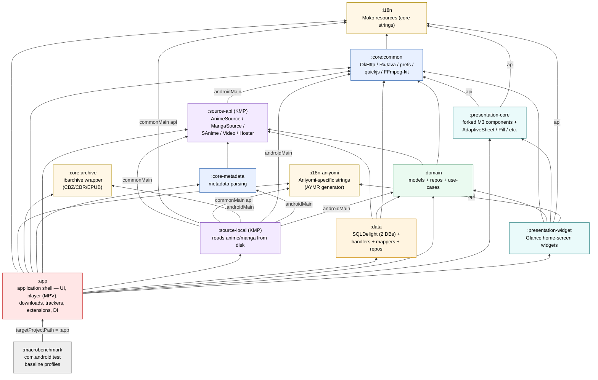

# 02 — Gradle Module Dependencies

The Kuta fork inherits Aniyomi's 13-module Gradle layout (declared in
`settings.gradle.kts`). The graph is a clean DAG — no cycles, no composite
builds. `:app` is the only `com.android.application` module and pulls in 11 of
the other 12 modules directly; `:macrobenchmark` is a `com.android.test`
module that targets `:app` via `targetProjectPath = ":app"` (not an
`implementation(project(...))` line). The leaf-most modules (`:i18n`,
`:i18n-aniyomi`, `:core:archive`) are depended-on by many but depend on
nothing project-internal. Arrows point from the dependent to its dependency
(i.e. `A --> B` means "A depends on B"). The four KMP modules (`:i18n`,
`:i18n-aniyomi`, `:source-api`, `:source-local`) only declare their project
deps under `androidMain` (or split commonMain / androidMain for `:source-local`).

## Notes

- **No `includeBuild`**: all 13 modules live in the single root Gradle build.
  `buildSrc/` (not a composite `build-logic/`) hosts the convention plugins
  under `mihon.buildlogic.*`.
- **`TYPESAFE_PROJECT_ACCESSORS`** preview is enabled, which is why the
  `build.gradle.kts` files write `projects.core.common` / `projects.i18nAniyomi`
  instead of `project(":core:common")`.
- **KMP modules**: `:i18n`, `:i18n-aniyomi`, `:source-api`, `:source-local`
  use `kotlin("multiplatform")` but only target `androidTarget()`. Their
  project dependencies are scoped under `androidMain` (or split
  commonMain / androidMain for `:source-local`), which is why some arrows are
  labelled with the source set.
- **Five version catalogs**: `libs` (default) + `kotlinx` + `androidx` +
  `compose` + `aniyomilibs`. The latter four are declared in
  `settings.gradle.kts` and re-declared in `buildSrc/settings.gradle.kts` so
  the `kotlin-dsl` buildSrc project can resolve them too.
- **Fork marker**: `app/build.gradle.kts:93–101` restricts `splits.abi` to
  `arm64-v8a` only (upstream ships multiple ABIs). `applicationId` is
  `app.kuta` (forked from Aniyomi's `xyz.jmir.tachiyomi.mi`); the package
  namespace `eu.kanade.tachiyomi` and `rootProject.name = "Aniyomi"` are
  unchanged.
- **Layering** (top-down): contract (`:source-api`) → core utility
  (`:core:common`, `:core:archive`, `:core-metadata`) → domain (`:domain`)
  → data (`:data`) → source impl (`:source-local`) → i18n (leaves) →
  presentation (`:presentation-core`, `:presentation-widget`) → app (`:app`)
  → test (`:macrobenchmark`).
