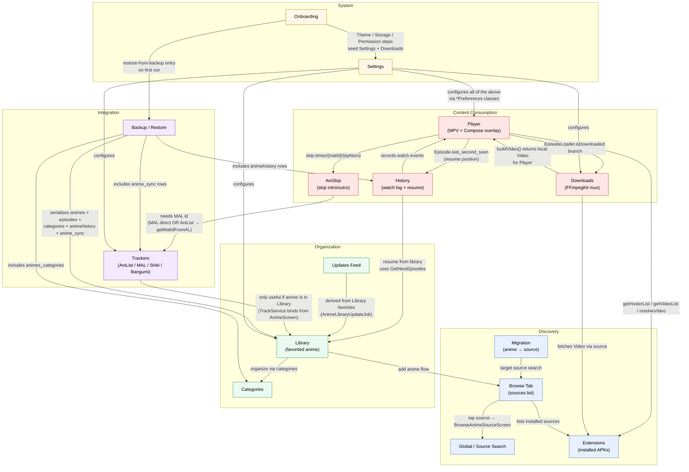

# 03 — Feature Relationships

This diagram maps the major user-facing features of Kuta to one another by
*runtime dependency* — i.e. "Feature A depends on Feature B" means A calls
into B's code or cannot function without B. The five subgraphs group features
by responsibility: **Content Consumption** (the playback path),
**Discovery** (browsing/searching sources), **Organization** (the user's
library), **Integration** (sync with the outside world), and **System**
(onboarding, settings). Edge labels spell out the specific call or contract
that creates the dependency. Several non-obvious transitivities jump out
when laid out this way: AniSkip → Trackers (because skip-intro needs the MAL
id from a linked tracker), Downloads → Player (because the downloader uses
the same `Video` model and FFmpegKit), and Backup → *everything* (because
backup serialises Library + History + Categories + Trackers).

## Notes

- **AniSkip → Trackers transitivity** is the most non-obvious edge in the
  graph: AniSkip queries `api.aniskip.com/v2/skip-times/{malId}/{epNum}` and
  gets the `malId` from a linked MAL tracker (directly) or from AniList via
  `getMalIdFromAL`. If no tracker is logged in, skip-intro silently does
  nothing — there is no fallback. So "skip intro" is gated on the user
  having linked at least one tracker.
- **Backup is a leaf of every persistent feature.** The backup serialiser
  walks `animes`, `episodes`, `animes_categories`, `categories`,
  `animehistory`, `anime_sync`, `extension_repos`, and `custom_buttons`.
  Removing any of those DB tables breaks backup — and the same is true in
  reverse for restore.
- **Migration depends on Browse** (not on Extensions directly) because
  migration re-uses `BrowseAnimeSourceScreen`'s search pipeline to find the
  target anime in the new source — it doesn't talk to the source itself.
- **Updates is downstream of Library, not upstream.** `AnimeLibraryUpdateJob`
  (a `CoroutineWorker` scheduled by `autoUpdateInterval()`) iterates over
  favorited anime and refreshes their episode lists; the Updates tab is just
  a feed view over the resulting `animeupdatesView` SQL view.
- **Settings isn't a hard dependency of the runtime features** in the
  compile-time sense — it's drawn here because every feature reads its
  `*Preferences` object (e.g. `PlayerPreferences`, `DownloadPreferences`,
  `LibraryPreferences`, `TrackPreferences`) and the Settings UI is the only
  way to mutate them. The `*Preferences` objects themselves are
  Injekt-injected singletons available app-wide.
- **Not shown** (to keep the graph readable): Onboarding → Settings is the
  only System-to-System edge; the Settings screens push into onboarding-like
  flows (e.g. tracker OAuth via `BaseOAuthLoginActivity`) but those are
  sub-flows of Settings, not separate top-level features.
