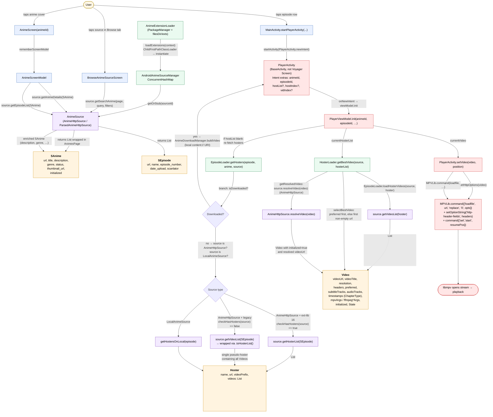

# 04 — Data Flow: Extension → Source → Anime → Episode → Player

The end-to-end pipeline that turns "user taps an episode in the list" into
"MPV opens a video stream". Each stage carries a typed data model from the
`:source-api` module — `SAnime` → `SEpisode` → `Hoster` → `Video` — and each
arrow is a real method call on the `AnimeSource` interface (or its concrete
`AnimeHttpSource` / `ParsedAnimeHttpSource` subclass). The pipeline has two
forks: the **new ext-lib 16 hoster API** (`getHosterList(episode)` →
`getVideoList(hoster)`) and the **legacy ext-lib 1.5 flat API**
(`getVideoList(episode)`, wrapped into a single pseudo-hoster by
`List<Video>.toHosterList()`). Both terminate in `HosterLoader.getBestVideo`
→ `source.resolveVideo(video)` → `PlayerActivity.setVideo` →
`MPVLib.command(loadfile)`.

## Notes

- **Two APIs, one pipeline.** The `AnimeSource` interface declares both
  `getHosterList(episode)` (ext-lib 16, the new hoster abstraction) and
  `getVideoList(episode)` (ext-lib 1.5, the legacy flat list).
  `EpisodeLoader.getHostersOnHttp` calls `checkHasHosters(source)` to decide
  which API to use; if the source only implements the legacy API, the result
  is wrapped into a single pseudo-hoster via `List<Video>.toHosterList()` so
  the rest of the pipeline is identical.
- **Downloaded-episode short-circuit.** If `EpisodeLoader.isDownload(episode,
  anime)` returns true (file exists on disk via `AnimeDownloadProvider`),
  the player gets a `Video` whose `videoUrl` is a local `content://` URI
  produced by `AnimeDownloadManager.buildVideo(...)`. No network call, no
  hoster fetch — MPV just `loadfile`s the local URI.
- **Intent-only handoff.** `AnimeScreen.openEpisode` →
  `MainActivity.startPlayerActivity` → `PlayerActivity.newIntent`. Only
  `animeId` and `episodeId` are required; the full `Video` list is *not*
  passed when launching from the episode list (the player re-fetches hosters
  / videos at runtime). `hostList` *can* be supplied as a JSON-serialized
  `List<Hoster>` (see `SerializableHoster.serialize()`) for the case where
  the user pre-picked a hoster/video from a dialog.
- **`resolveVideo` is lazy.** A `Video` from `getVideoList(hoster)` may have
  `initialized = false` and a `videoUrl` that is only a *page* URL, not a
  playable stream URL. `HosterLoader.getResolvedVideo` calls
  `AnimeHttpSource.resolveVideo(video)` (only for `AnimeHttpSource` + un-
  initialized videos) to resolve the page URL to the actual stream URL.
  The first video whose resolved `videoUrl` is non-empty short-circuits the
  search.
- **Resume position** is pushed to MPV via `MPVLib.command(["set", "start",
  "<seconds>"])` *before* `loadfile`. The position comes from
  `episode.last_second_seen` (unless the episode is marked seen and
  `preserveWatchingPosition()` is false, in which case it's 0).
- **HTTP headers** are pushed via `MPVLib.setOptionString("http-header-fields",
  ...)` from `video.headers ?: source.headers`. Subtitle/audio tracks from
  `video.subtitleTracks` / `video.audioTracks` are pushed via `sub-add` /
  `audio-add` after `loadfile`. Skip-intro timestamps from
  `video.timestamps` (typed by `ChapterType`) drive the auto-skip UX.
