# 05 — Current UI Structure (Material 3, Post-Phase-1)

This is the **baseline "what exists today"** UI hierarchy for the upcoming
design overhaul. The root is `PlaceholderHomeScreen` (Phase 1), which pushes
`HomeScreen` (the Voyager `TabNavigator`). The tab navigator renders five
visible tabs — `MangaLibraryTab` is forcibly stripped from `NavStyle.tabs`.
Each tab is a Compose `Content()` composable that hosts a Scaffold-based
screen; pushed detail screens (`AnimeScreen`, `SettingsScreen`, etc.) share
the single root `Navigator`. Material 3 `Scaffold` is the dominant shell
(162 occurrences app-wide), but the app **forks** several M3 components
(`Scaffold`, `Button`, `NavigationBar`, `NavigationRail`, `Slider`, `Surface`,
`AlertDialog`, `FloatingActionButton`, `Tabs`) into
`presentation-core/.../components/material/` — these forks are the natural
seam for the design replacement. `AdaptiveSheet` (custom) replaces M3
`ModalBottomSheet` (which is unused). The manga-side sub-tabs in
`BrowseTab` / `HistoriesTab` / `CategoriesTab` / `StatsTab` / `StorageTab` /
`DownloadsTab` / `UpdatesTab` are still rendered — this is the deferred
Phase-2 cleanup target.

```mermaid
graph TD
    classDef root fill:#e8f0ff,stroke:#3b6fb5,color:#000
    classDef tabShell fill:#fff4e0,stroke:#cc8a00,color:#000
    classDef tab fill:#eafaf0,stroke:#2e8b57,color:#000
    classDef pushed fill:#f3eaff,stroke:#7a3fb5,color:#000
    classDef dialog fill:#ffe6e6,stroke:#cc3333,color:#000
    classDef player fill:#ffe6e6,stroke:#cc3333,color:#000
    classDef manga fill:#eee,stroke:#999,color:#666,stroke-dasharray: 5 5

    %% ---------- Root ----------
    Root["PlaceholderHomeScreen<br/>(new root — Phase 1)<br/>Material 3 Scaffold-free<br/>Centered Column + 2 Buttons"]:::root

    %% ---------- Tab Navigator ----------
    HomeScreen["HomeScreen<br/>— Scaffold (forked) with bottomBar=NavigationBar (forked)<br/>  or startBar=NavigationRail (forked, tablet)<br/>— TabNavigator(5 visible tabs)<br/>— AnimatedContent (materialFadeThrough, 200ms)"]:::tabShell

    Root -- "Library button → navigator.push(HomeScreen)" --> HomeScreen

    %% ---------- Visible Tabs ----------
    AnimeLibraryTab["AnimeLibraryTab<br/>— AnimeLibraryScreen (Scaffold)<br/>— per-category pager (Grid/List)<br/>— FAB (FloatingActionAddButton)<br/>— AnimeLibrarySettingsDialog (AdaptiveSheet)<br/>— LibraryToolbar / LibraryBadges"]:::tab

    UpdatesTab["UpdatesTab<br/>— TabbedScreen (forked Scaffold +<br/>  ScrollableTabRow + HorizontalPager)<br/>— sub-tabs: anime updates | <i>manga updates</i>"]:::tab

    HistoriesTab["HistoriesTab<br/>— TabbedScreen<br/>— sub-tabs: anime history | <i>manga history</i><br/>— AnimeHistoryScreen (LazyColumn grouped by date)<br/>— overflow: Clear history"]:::tab

    BrowseTab["BrowseTab<br/>— TabbedScreen(scrollable=true, 6 sub-tabs)<br/>  1. Anime Sources<br/>  2. <i>Manga Sources</i><br/>  3. Anime Extensions<br/>  4. <i>Manga Extensions</i><br/>  5. Migrate anime<br/>  6. <i>Migrate manga</i><br/>— hoisted ScreenModels for shared search bar"]:::tab

    MoreTab["MoreTab<br/>— MoreScreen (LazyColumn)<br/>— LogoHeader<br/>— DownloadedOnly / Incognito toggles<br/>— NavStyle selector<br/>— 8 navigation rows"]:::tab

    HomeScreen --- AnimeLibraryTab
    HomeScreen --- UpdatesTab
    HomeScreen --- HistoriesTab
    HomeScreen --- BrowseTab
    HomeScreen --- MoreTab

    %% ---------- Pushed screens from More ----------
    SettingsScreen["SettingsScreen<br/>— own Navigator rooted at SettingsMainScreen<br/>— TwoPanelBox on tablet (two-pane)<br/>— 11 category screens<br/>— SettingsSearchScreen (magnifier)"]:::pushed
    CategoriesTab["CategoriesTab<br/>— anime/manga sub-tabs (still mixed)<br/>— LazyColumn + drag handle"]:::pushed
    StatsTab["StatsTab<br/>— anime/manga sub-tabs (still mixed)<br/>— StatSection cards"]:::pushed
    StorageTab["StorageTab<br/>— anime/manga sub-tabs (still mixed)<br/>— breakdown by source/anime"]:::pushed
    DownloadsTab["DownloadsTab<br/>— 2-page pager: anime | <i>manga</i><br/>— AnimeDownloadQueueScreen (legacy RecyclerView-in-Compose)"]:::pushed
    PlayerSettingsScreen["PlayerSettingsScreen<br/>— Voyager Screen shell<br/>— pushes PlayerSettingsMainController views"]:::pushed
    AboutScreen["AboutScreen<br/>— 'Kuta' / 'Based on Aniyomi' (Phase 1)<br/>— LinkIcon rows (Discord, Github)"]:::pushed

    MoreTab --> SettingsScreen
    MoreTab --> CategoriesTab
    MoreTab --> StatsTab
    MoreTab --> StorageTab
    MoreTab --> DownloadsTab
    MoreTab --> PlayerSettingsScreen
    MoreTab --> AboutScreen

    %% ---------- Pushed detail screens ----------
    AnimeScreen["AnimeScreen(animeId)<br/>— Scaffold + AnimeInfoHeader<br/>— EpisodeList (LazyColumn)<br/>— EntryBottomActionMenu"]:::pushed
    BrowseAnimeSourceScreen["BrowseAnimeSourceScreen<br/>— Scaffold + source search<br/>— LazyGrid of source anime"]:::pushed
    AnimeExtensionsScreen["AnimeExtensionsScreen<br/>— LazyColumn + repo row<br/>— per-extension install/update row"]:::pushed
    AnimeExtensionDetailsScreen["AnimeExtensionDetailsScreen<br/>— sources list + Readme / Changelog / Uninstall"]:::pushed
    GlobalAnimeSearchScreen["GlobalAnimeSearchScreen<br/>— per-source result cards<br/>— 'All' / 'Pinned only' chip row"]:::pushed

    AnimeLibraryTab -- "tap anime" --> AnimeScreen
    UpdatesTab -- "tap row" --> AnimeScreen
    HistoriesTab -- "tap cover" --> AnimeScreen
    BrowseTab -- "Anime Sources sub-tab → tap source" --> BrowseAnimeSourceScreen
    BrowseAnimeSourceScreen -- "tap anime" --> AnimeScreen
    BrowseTab -- "Anime Extensions sub-tab" --> AnimeExtensionsScreen
    AnimeExtensionsScreen -- "tap extension" --> AnimeExtensionDetailsScreen
    BrowseTab -- "onReselect" --> GlobalAnimeSearchScreen
    GlobalAnimeSearchScreen -- "tap result" --> AnimeScreen

    %% ---------- Player ----------
    PlayerActivity["PlayerActivity<br/>(standalone Activity — not Compose-only)<br/>— player_layout.xml hosts AniyomiMPVView<br/>— Compose PlayerControls overlay<br/>— QualitySheet / SubtitleSheet / SettingsSheet (AdaptiveSheet)"]:::player

    AnimeScreen -- "openEpisode → MainActivity.startPlayerActivity" --> PlayerActivity
    HistoriesTab -- "Resume → GetNextEpisodes" --> PlayerActivity

    %% ---------- Dialogs / sheets ----------
    subgraph DLG["Dialogs & Bottom Sheets (AdaptiveSheet-based)"]
        AnimeTrackInfoDialog["AnimeTrackInfoDialog<br/>(tracker search + status/score/date)"]
        AnimeLibrarySettingsDialog["AnimeLibrarySettingsDialog<br/>(filter/sort/display per category)"]
        AnimeTrackSearchDialog["AnimeTrackSearchDialog"]
        EpisodeSettingsDialog["EpisodeSettingsDialog<br/>(per-anime filter/sort/display)"]
        AnimeCategoryDialog["AnimeCategoryDialog<br/>(set categories)"]
        RemoveHistoryDialog["RemoveHistoryDialog<br/>(3 granularities)"]
        AdaptiveSheet["AdaptiveSheet<br/>(phone=bottom sheet / tablet=centered dialog)<br/>— replaces M3 ModalBottomSheet (unused)"]
    end
    class AnimeTrackInfoDialog,AnimeLibrarySettingsDialog,AnimeTrackSearchDialog,EpisodeSettingsDialog,AnimeCategoryDialog,RemoveHistoryDialog,AdaptiveSheet dialog

    AnimeScreen -. "track button" .-> AnimeTrackInfoDialog
    AnimeScreen -. "episode overflow" .-> EpisodeSettingsDialog
    AnimeScreen -. "set categories" .-> AnimeCategoryDialog
    AnimeLibraryTab -. "filter icon" .-> AnimeLibrarySettingsDialog
    HistoriesTab -. "overflow → remove" .-> RemoveHistoryDialog
    AnimeTrackInfoDialog -. "uses" .-> AdaptiveSheet
    AnimeLibrarySettingsDialog -. "uses" .-> AdaptiveSheet
    EpisodeSettingsDialog -. "uses" .-> AdaptiveSheet

    %% ---------- Manga UI still rendered ----------
    subgraph MANGAUI["Manga sub-tabs still rendered inside shared tabs (Phase-2 cleanup target)"]
        MangaSourcesSub["Manga Sources sub-tab"]
        MangaExtensionsSub["Manga Extensions sub-tab"]
        MigrateMangaSub["Migrate Manga sub-tab"]
        MangaHistorySub["Manga History sub-tab"]
        MangaUpdatesSub["Manga Updates sub-tab"]
    end
    class MangaSourcesSub,MangaExtensionsSub,MigrateMangaSub,MangaHistorySub,MangaUpdatesSub manga

    BrowseTab -. "still renders" .-> MangaSourcesSub
    BrowseTab -. "still renders" .-> MangaExtensionsSub
    BrowseTab -. "still renders" .-> MigrateMangaSub
    HistoriesTab -. "still renders" .-> MangaHistorySub
    UpdatesTab -. "still renders" .-> MangaUpdatesSub
```

## Notes

- **Scaffold is the dominant shell, but it's the forked one.** The
  `tachiyomi.presentation.core.components.material.Scaffold` fork adds a
  `startBar` slot (for `NavigationRail` on tablets), passes the topBar
  scroll behaviour through, removes the expanded-app-bar height constraint,
  and includes FAB height in inner padding. Replacing the fork's internals
  (rather than chasing ~162 call sites) is the design-overhaul leverage
  point — but only for callers that import the fork; ~290 files still import
  `androidx.compose.material3.*` directly.
- **`AdaptiveSheet` replaces M3 `ModalBottomSheet`** app-wide (M3 count = 0).
  On phones it's a bottom sheet; on tablets it's a centered dialog. Every
  per-anime/per-category settings sheet, every track dialog, and every
  quality/subtitle picker in the player goes through `AdaptiveSheet`.
- **Player UI is hybrid (XML + Compose)**. `player_layout.xml` hosts the
  `<AniyomiMPVView>` surface; the `PlayerControls` composable is overlaid
  on top. This is the only major screen that is not pure Compose. The
  settings sheets inside the player (`QualitySheet`, `SubtitleSheet`,
  `SettingsSheet`) are Compose `AdaptiveSheet` variants.
- **Two-pane tablet mode** is opt-in: `SettingsScreen` switches to
  `TwoPanelBox` (master/detail) on tablets. `HomeScreen` itself switches
  from `NavigationBar` to `NavigationRail` via `isTabletUi()`.
- **Manga sub-tabs are still rendered** (dashed nodes) inside the shared
  `BrowseTab` / `HistoriesTab` / `UpdatesTab` / `CategoriesTab` / `StatsTab`
  / `StorageTab` / `DownloadsTab` pagers — this is the deferred Phase-2
  cleanup target flagged in the Task 4 worklog. Removing them is the
  visible-graph equivalent of removing `MangaLibraryTab` from `NavStyle.tabs`.
- **`AnimeDownloadQueueScreen`** is the only legacy `RecyclerView`-wrapped-
  in-Compose screen left in the app — flagged in the Task 5-b worklog as a
  re-skin candidate.
- **No custom Typography / Shapes** are passed to `MaterialTheme`; the app
  uses the M3 defaults. The single typography extension is
  `Typography.header` (used for settings section headers). Default text
  style is overridden to `bodySmall` in `setComposeContent`.
