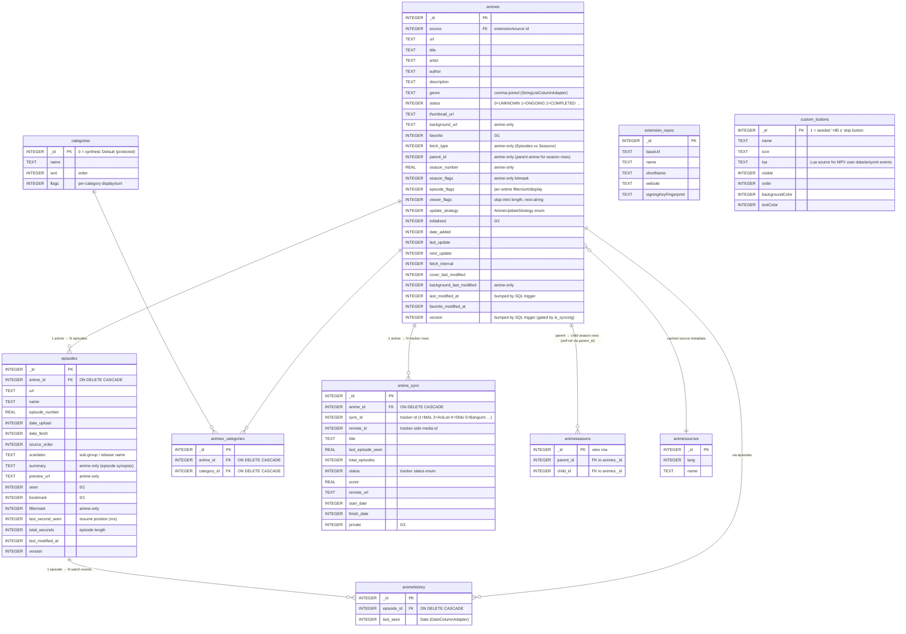
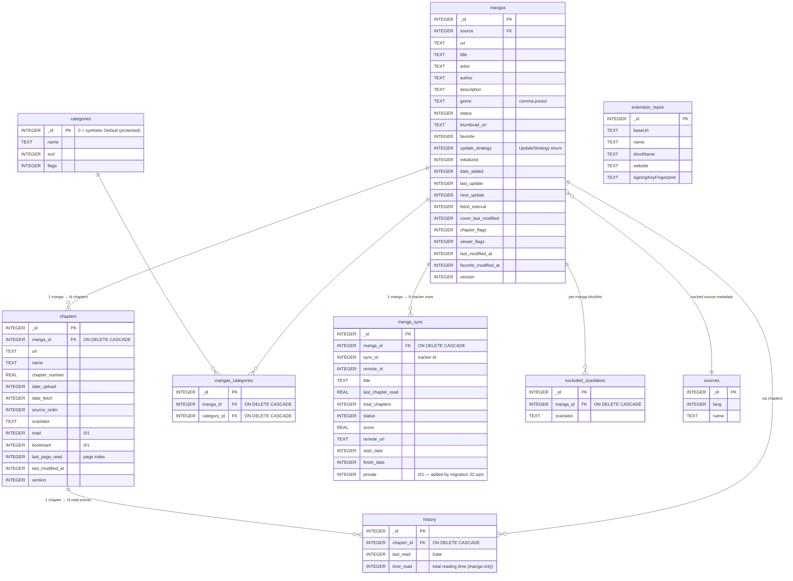

# 06 — Database Schema (Both SQLDelight DBs)

Kuta ships **two independent SQLite databases** in the `:data` module:

- **`tachiyomi.db`** (the manga DB, package `tachiyomi.data`) — 9 tables +
  3 views, schema version 32 (migrations `1.sqm` … `32.sqm`).
- **`tachiyomi.animedb`** (the anime DB, package `tachiyomi.mi.data`) — 9
  tables + 8 views, schema version 135 (migrations `113.sqm` … `135.sqm`).

The anime DB's migration sequence starts at 113 (not 1), strongly suggesting
the anime schema was forked from the manga schema at the point where manga's
schema was at version ~112; the two have diverged since. Both DBs enforce
`foreign_keys = ON`, `journal_mode = WAL`, `synchronous = NORMAL` on every
`onOpen`. Both use SQL triggers to maintain `version` and `last_modified_at`
columns on the core entity tables (gated by an `is_syncing` flag for sync-
driven writes). `Category` is the only domain model shared by both sides
(there are two `categories` tables, one per DB, both with the same shape and
a synthetic `_id = 0` "Default" row protected by a
`system_category_delete_trigger`).

The two ER diagrams below are intentionally separate — there are **no
cross-database foreign keys** (SQLite cannot enforce them), so the two
graphs are completely disjoint.

## 6.1 — Anime DB (`tachiyomi.animedb`)

## 6.2 — Manga DB (`tachiyomi.db`)

> The manga DB is **still fully present** even though the manga UI has been
> gated out. Its tables, migrations, mappers, repositories, and domain
> models are intact and wired in `AppModule.kt`. Removing the UI did not
> touch this schema.

## Notes

- **Two databases, not one.** Most Tachiyomi/Mihon forks keep a single DB.
  Kuta splits anime and manga into separate SQLite files with their own
  generated `Database` / `AnimeDatabase` interfaces, their own handlers
  (`AndroidMangaDatabaseHandler` / `AndroidAnimeDatabaseHandler`), their own
  mappers, and their own migration sequences. This doubles the data-layer
  surface and is the reason every repository is duplicated under
  `.../anime/` and `.../manga/` packages.
- **`animehistory` has no `time_read` column** (manga `history` does). Anime
  watch duration is reconstructed from `episodes.last_second_seen` /
  `total_seconds` at view time (via `animehistoryView` and
  `animehistorystatsView`). This asymmetry is mirrored in the domain models
  (`AnimeHistory` vs `MangaHistory` — the latter has `readDuration`).
- **Anime-only columns on `animes`**: `fetch_type` (Episodes vs Seasons),
  `parent_id` (parent anime for season rows), `season_flags`,
  `season_number`, `season_source_order`, `background_url`,
  `background_last_modified`. These support season grouping and background
  art — there is no manga equivalent.
- **Anime-only columns on `episodes`**: `last_second_seen` (resume position),
  `total_seconds` (episode length), `summary` (episode synopsis),
  `preview_url` (episode thumbnail), `fillermark`. Manga `chapters` has
  `last_page_read` instead (page index) and no filler / preview / summary.
- **`custom_buttons`** is anime-only (seeds a "+85 s" skip-intro button at
  `_id=1` via migration 129). The buttons back the MPV Lua bridge — Lua
  source is stored in the `lua` column and pushed to MPV's
  `user-data/aniyomi` JSON events at player start.
- **`extension_repos` is duplicated** in both DBs (one for anime extensions,
  one for manga extensions). Both have identical schemas.
- **Schema version divergence**: manga DB is at v32, anime DB is at v135.
  The anime DB started its migration sequence at `113.sqm` (not `1.sqm`),
  strongly suggesting the anime DB was forked from the manga DB at the point
  where manga's schema was at version ~112; the two have diverged since.
  Migrations are plain SQL `.sqm` files — no Kotlin `Migration` registry
  (no Room-style migration graph).
- **SQL views** (not shown in the ER diagrams): manga has 3 (`libraryView`,
  `historyView`, `updatesView`); anime has 8 (`animelibView`,
  `animehistoryView`, `animeupdatesView`, `animedeletableView`,
  `animeseasonsView`, `animeseasonstatsView`, `animehistorystatsView`,
  `episodestatsView`). The views feed the Library / History / Updates tabs
  and the per-anime aggregate counts shown as `LibraryAnime` /
  `LibraryManga`.
- **`version` and `last_modified_at` are trigger-maintained.** Every
  `UPDATE` on `animes` / `mangas` / `episodes` / `chapters` fires a SQL
  trigger that bumps `last_modified_at`; further triggers bump `version`
  (unless `is_syncing = 1`). The domain models surface these as plain
  `Long` fields; they power the sync feature and should never be written
  manually.
- **No cross-database FKs.** SQLite cannot enforce them, so the two ER
  diagrams above are completely disjoint. `Anime ↔ Manga` parallelism is
  exhaustive at the schema level but the two sides never reference each
  other.
