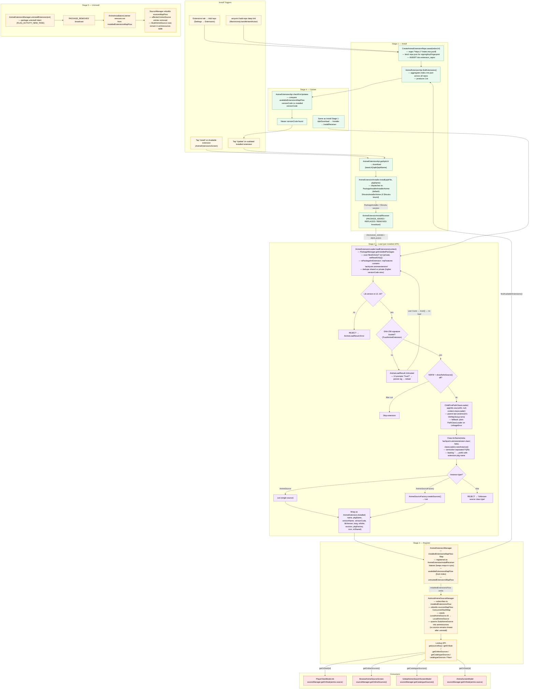

# 07 — Extension Lifecycle

The anime extension subsystem has five distinct stages: **Install**, **Load**,
**Register**, **Update**, and **Uninstall**. The diagram below traces each
stage from its entry point through the manager singletons
(`AnimeExtensionManager`, `AndroidAnimeSourceManager`) and the loader
(`AnimeExtensionLoader`) down to the point where an `AnimeSource` instance is
available to the player / browse / search pipelines. The install path is
shared by all three trigger points (manual install from the Extensions tab,
an update, or an `aniyomi://add-repo` deep link); only the upstream "where
did the APK come from" differs. The loader is the security-sensitive stage —
it validates the lib version range (12..16), runs the SHA-256 signature
trust check via `TrustAnimeExtension`, and instantiates the source class
through a parent-last `ChildFirstPathClassLoader` (falling back to a plain
`PathClassLoader` on `LinkageError`).

## Notes

- **No hard-coded default repo URL.** This fork does **not** bake in the
  upstream Aniyomi default repo (`raw.githubusercontent.com/aniyomiorg/aniyomi-extensions/repo`).
  Repos are entirely user-managed: added via the Settings → Extensions →
  "Add repo" UI or via the `aniyomi://add-repo` / `tachiyomi://add-repo`
  deep links handled in `MainActivity`. URLs must match
  `^https://.*/index\.min\.json$` (validated by `CreateAnimeExtensionRepo`).
- **Two installer backends.** `AnimeExtensionInstaller` dispatches to either
  `PackageInstallerInstallerAnime` (the Android system `PackageInstaller`
  API, default) or `ShizukuInstallerAnime` (if Shizuku is bound, which lets
  the app install APKs without the system install dialog). The choice is
  transparent to the rest of the pipeline.
- **`ChildFirstPathClassLoader` is parent-last.** Extension APKs ship their
  own copy of common dependencies (OkHttp, Jsoup, etc.) and the parent-last
  ordering ensures the extension's bundled versions win over the app's. This
  is what lets an extension built against an older lib still load. On
  `LinkageError`, the loader falls back to a plain `dalvik.system.PathClassLoader`
  (parent-first).
- **Lib version range 12..16.** Parsed from the part of `versionName` before
  the last `.` (e.g. `16.0.1` → lib version `16`). Outside the range, the
  extension is rejected with `AnimeLoadResult.Error`. Current min = 12,
  current max = 16.
- **SHA-256 signature trust is opt-in per signature.** `TrustAnimeExtension`
  maintains a list of trusted SHA-256 certificate fingerprints. Untrusted
  extensions are returned as `AnimeLoadResult.Untrusted`; the UI prompts
  the user to trust the signature, after which it is persisted and the
  extension is re-loaded.
- **Package naming convention**: `eu.kanade.tachiyomi.animeextension.<lang>.<name>`
  (anime) vs `eu.kanade.tachiyomi.extension.<lang>.<name>` (manga). The
  feature flag in the manifest is `tachiyomi.animeextension` (anime) vs
  `tachiyomi.extension` (manga). The class metadata key is
  `tachiyomi.animeextension.class` (anime) vs `tachiyomi.extension.class`
  (manga).
- **Multi-source extensions** declare a semicolon-separated list of FQNs in
  `tachiyomi.animeextension.class`. A leading `.` is prefixed with the
  extension's package name. If the entry class implements `AnimeSource`
  directly, it's wrapped in a single-element list; if it implements
  `AnimeSourceFactory`, `createSources()` is called to get the list.
- **Stub sources survive uninstall.** When an extension is uninstalled, the
  `AnimeSource` entries are removed from the in-memory
  `ConcurrentHashMap<Long, AnimeSource>`, but the `StubAnimeSource` rows in
  the `animesources` table remain. This is so anime entries that referenced
  the now-uninstalled source can still display "source: <name>" rather than
  crashing.
- **Update flow reuses the install pipeline.** The only difference between
  install and update is the trigger: update is fired by the user tapping
  "Update" on an outdated installed extension (after
  `AnimeExtensionApi.checkForUpdates` detects a newer `versionCode` in the
  index). The actual APK download + installer + broadcast + load flow is
  identical to a fresh install.
